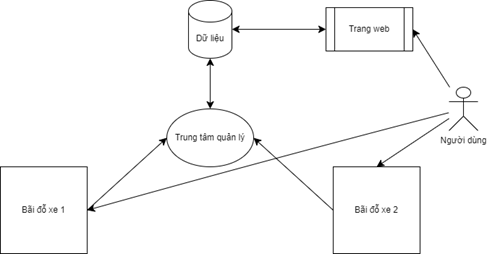
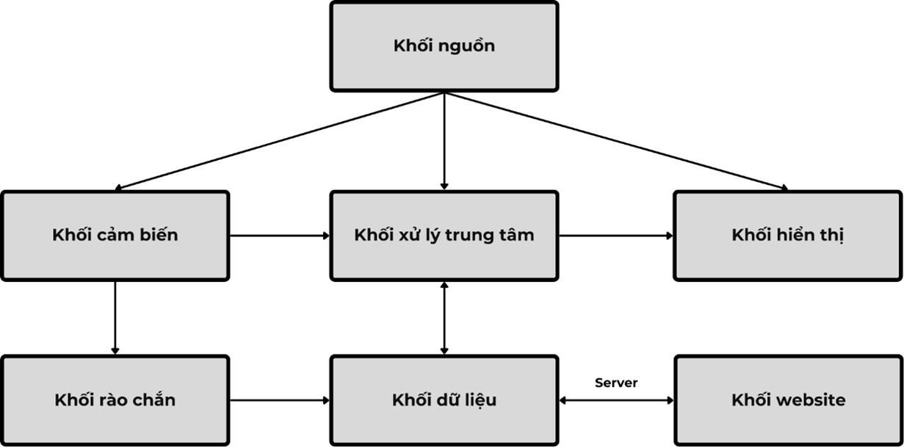
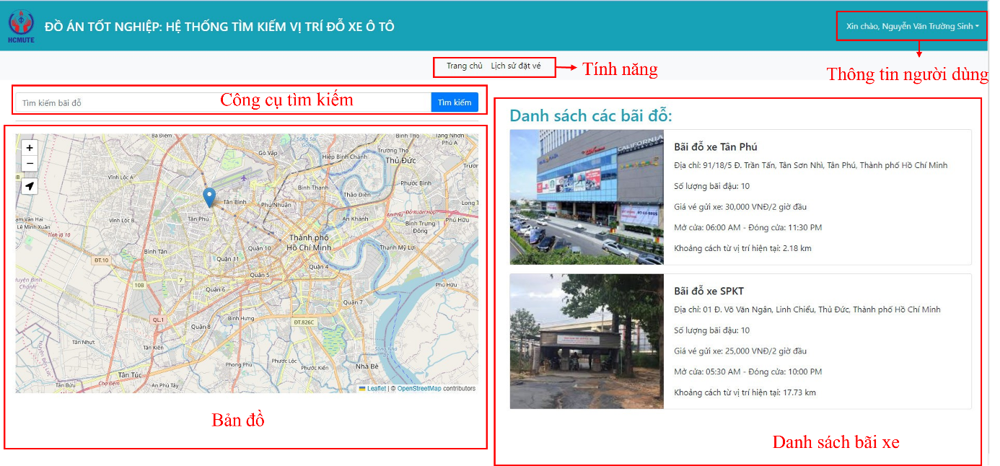
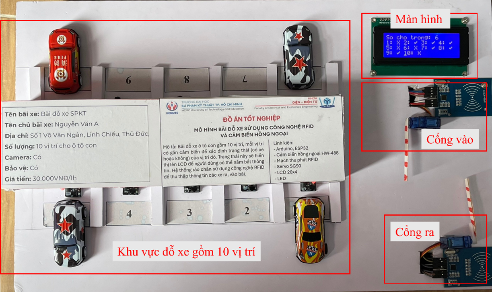
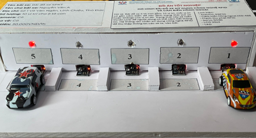

# Hệ thống tìm kiếm vị trí đỗ xe

## Giới thiệu
Trong bối cảnh số lượng ô tô ngày càng gia tăng, việc tìm kiếm chỗ đỗ xe trở nên khó khăn và gây lãng phí thời gian. Đề tài “Thiết kế mô hình hệ thống tìm kiếm vị trí đỗ xe ô tô” nhằm giải quyết vấn đề này bằng cách cung cấp giải pháp hiện đại, giúp người dùng dễ dàng tìm kiếm các vị trí đỗ xe còn trống.

Hệ thống sử dụng vi điều khiển Arduino Mega 2560 lập trình bằng ngôn ngữ C, kết hợp với màn hình LCD để cung cấp thông tin thời gian thực về số lượng chỗ đỗ xe còn lại. Cảm biến hồng ngoại (IR) được sử dụng để phát hiện xe vào và ra khỏi bãi đỗ xe. Mô hình phần cứng được thiết kế khoa học, tích hợp rào chắn tự động với động cơ servo SG90 và công nghệ RFID để quản lý ra vào.

Trang web của hệ thống được phát triển bằng Python, sử dụng framework Django, cho phép người dùng kiểm tra tình trạng các chỗ đỗ xe và đặt chỗ trực tuyến. Website được thiết kế theo kiến trúc MVT (Model-View-Template), kết hợp giao tiếp với vi điều khiển Arduino Mega 2560 và ESP32 thông qua chuẩn UART. Dữ liệu từ các cảm biến được xử lý và cập nhật liên tục lên website, đảm bảo cung cấp thông tin kịp thời và chính xác.

## Các tính năng chính
- Hiển thị thông tin thời gian thực về số lượng chỗ đỗ xe còn lại qua màn hình LCD.
- Theo dõi xe vào và ra bằng cảm biến hồng ngoại IR.
- Tự động điều khiển rào chắn bằng động cơ servo SG90.
- Quản lý xe ra vào thông qua công nghệ RFID.
- Giao diện web cho phép kiểm tra tình trạng chỗ đỗ và đặt chỗ trực tuyến.
- Hệ thống phân cấp quản lý bãi đỗ xe: quản trị viên, chủ bãi xe và khách hàng.
- Tích hợp giao tiếp giữa hệ thống Arduino và trang web qua UART.

## Hình ảnh minh họa

### Mô hình hệ thống

### Giao diện trang web

### Mô hình phần cứng

## Video minh họa
Xem video trình diễn cách hoạt động của hệ thống tại [YouTube](https://youtu.be/rE3_HVR2oAg).

## Công nghệ sử dụng
- Ngôn ngữ lập trình: C, Python
- Framework web: Django
- Vi điều khiển: Arduino Mega 2560, ESP32
- Động cơ servo: SG90
- Màn hình hiển thị: LCD 20x4
- Cảm biến: Hồng ngoại (IR)
- Công nghệ nhận dạng: RFID
- Giao thức: UART

## Tài liệu chi tiết
Bạn có thể tải xuống tài liệu chi tiết của đồ án dưới dạng PDF tại liên kết sau: [Tải xuống tài liệu đồ án](https://drive.google.com/file/d/1lAmccCnmShYzYUMBf83VBdPLXpxvZLgz/view?usp=sharing).

## Đóng góp
Mọi đóng góp và phản hồi vui lòng liên hệ qua GitHub hoặc email của tác giả.
